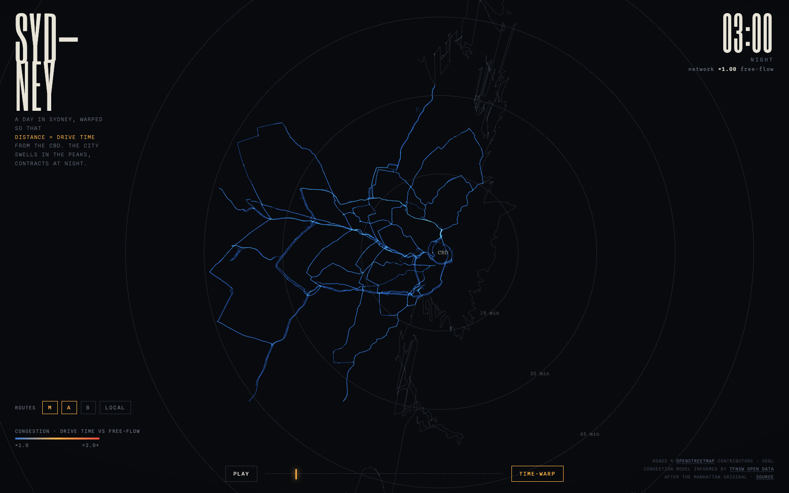
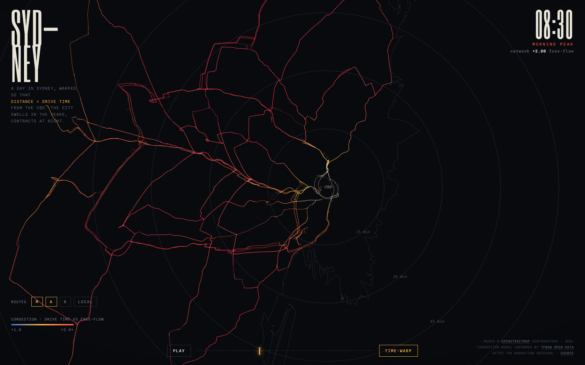

# Sydney Time Warp

**A day in Sydney, warped so that distance ≈ drive time.**

Every road vertex is positioned at `radius = drive time from the CBD` along its true
bearing — so the map *is* an isochrone. Drive times swell in the morning and evening
rush hour, then contract at night, and the whole city breathes.

**Live: <https://rajanmali.github.io/sydney-time-warp/>**

| 03:00 — free flow | 08:30 — morning peak |
|---|---|
|  |  |

Inspired by [the Manhattan original](https://x.com/cosmic_yolo_bot/status/2064610059313905781).

## How it works

```
OpenStreetMap (Overpass API)
  └─ 35k ways: motorway → secondary, Sydney metro bbox
       └─ scripts/build-data.mjs
            ├─ split ways into 38k edges at 32k junctions
            ├─ Dijkstra from the CBD × 4 congestion profiles
            │    (night free-flow · AM peak · midday · PM peak)
            └─ data/sydney.bin — per vertex: bearing, geo distance,
               4 drive-time anchors (2.9 MB, struct-of-arrays)
                 └─ src/main.js (Three.js)
                      vertex shader blends the 4 anchors with Gaussian
                      day-curve weights → radius = driveTime × scale.
                      The day cycle never touches a buffer: 100% GPU.
```

- **Colour** = congestion (current drive time ÷ free-flow): blue → amber → ember.
- **Brightness** = road class (motorways brightest).
- **Rings** = 15/30/45/60/90/120-minute isochrones — circles, by construction.
- **Filters** = NSW route categories from OSM `ref` tags: M and A routes by default;
  B and unsigned local roads toggleable.
- **Gray line** = the coastline, warped along with the roads (each coast vertex
  borrows its nearest road junction's drive times).
- Toggle **Time-warp / Geographic** to morph between the two layouts.
- URL params: `?h=8.5` start the clock at 08:30, `?play=0` pause, `?cats=mabl`
  pick route categories.

## Congestion model

A static page can't call authenticated live-traffic APIs, so congestion is modelled
before Dijkstra, with shapes informed by
[TfNSW traffic volume patterns](https://opendata.transport.nsw.gov.au/data/dataset/nsw-roads-traffic-volume-counts-api).
Each edge's travel-time multiplier is the product of three parts, so the peaks
balloon specific corridors instead of inflating the whole map uniformly:

1. **Class ceiling** — how bad that road type can get:

   | Class | Night | AM peak | Midday | PM peak |
   |---|---|---|---|---|
   | Motorway | ×1.0 | ×2.4 | ×1.35 | ×2.3 |
   | Trunk | ×1.0 | ×2.3 | ×1.3 | ×2.2 |
   | Primary | ×1.0 | ×2.25 | ×1.3 | ×2.2 |
   | Secondary | ×1.0 | ×2.0 | ×1.25 | ×2.1 |

2. **Ring profile** — congestion peaks in the 6–18 km middle suburbs, easing off
   in the compact core and at the metro fringe.
3. **Corridor factor** — a deterministic per-corridor hash (0.7–1.3) so parallel
   routes degrade differently and the warp turns lumpy.

The graph is undirected (one-way streets ignored) — fine for a visualisation,
wrong for a router.

## Develop

No dependencies, no bundler. Three.js comes from a CDN import map.

```bash
npm run fetch   # download raw OSM data from Overpass → data/raw/
npm run build   # raw data → data/sydney.bin + data/manifest.json
npm run serve   # http://localhost:8000
```

## Data sources

- Road geometry: [OpenStreetMap](https://www.openstreetmap.org/copyright) via the
  [Overpass API](https://overpass-api.de/) — © OpenStreetMap contributors, ODbL.
- Congestion shape: [Transport for NSW Open Data Hub](https://opendata.transport.nsw.gov.au/) —
  [Traffic Volume Viewer](https://www.transport.nsw.gov.au/operations/roads-and-waterways/corporate-publications/statistics/traffic-statistics/traffic-volume).

## Licence

Code: [MIT](LICENSE). Map data: © OpenStreetMap contributors,
[ODbL](https://opendatacommons.org/licenses/odbl/).
